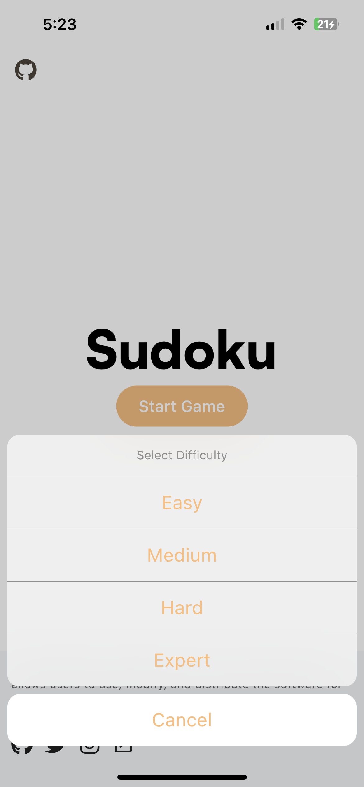
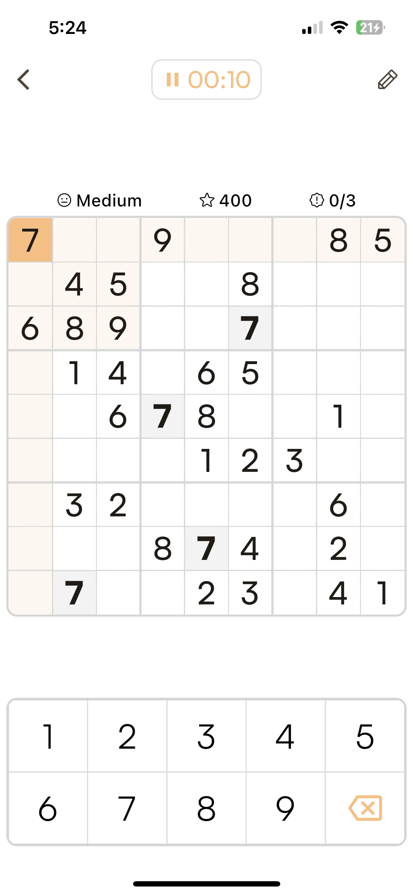
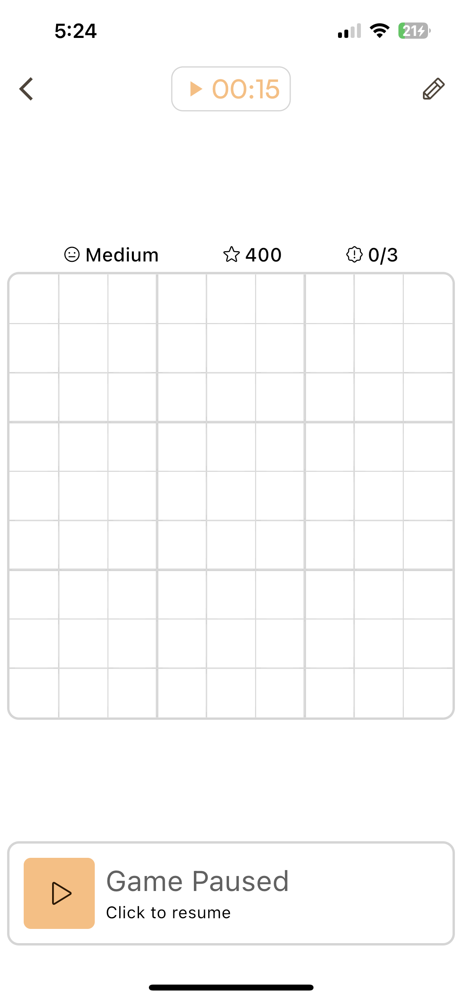
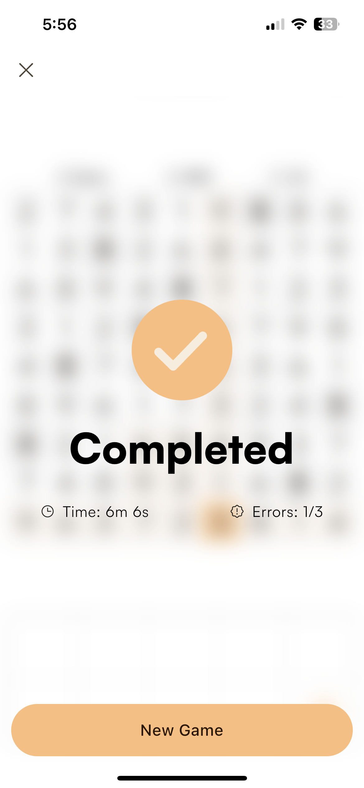
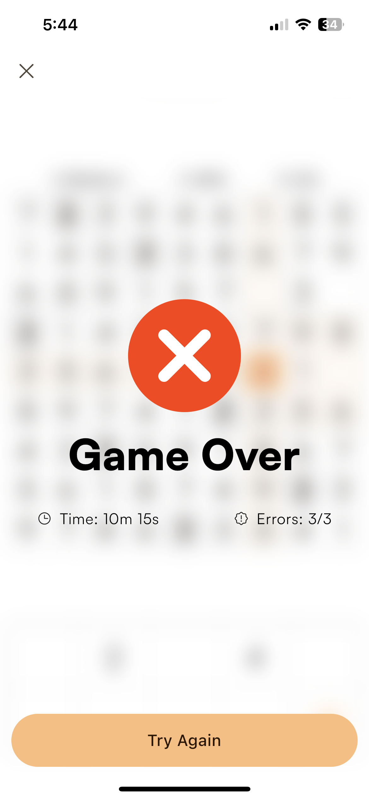

# Sudoku

I developed Sudoku, a classic puzzle game that challenges players to fill in a grid of cells with the digits 1-9 such that each row, column, and 3x3 subgrid (also known as boxes or blocks) contains all the digits 1-9. My app offers a clean and intuitive interface that allows players to easily choose from a variety of pre-generated puzzles of different difficulties.

## Features

- Multiple difficulty levels: Choose from easy, medium, hard, or expert puzzles.
- Timer: Keep track of how long it takes you to solve a puzzle.
- Custom puzzles: Input your own puzzles to solve or share with others.
- Progress tracker: See your stats and improve your skills over time.

## Screenshots

## Development

I developed this Sudoku game using Flutter, a modern, cross-platform framework for building mobile and web applications. I utilized the provider state management package to manage and share app state across the widgets in the app.

The codebase is clean and well-organized, following best practices for Flutter development. The user interface is visually appealing and easy to use, showcasing my attention to detail and design skills.

To ensure that the app is reliable and easy to use, I focused on implementing robust error handling and debugging techniques during development. As a result, users can expect a smooth and enjoyable experience when playing this app. Overall, I am proud to present this app as a great example of a well-designed and well-implemented Flutter app.
